  

 

---

### 👾 Sobre mí

Soy el fundador de **IAutoPYMES**, una consultora de automatización e IA para empresas y autónomos. Me encargo de todo lo técnico: arquitectura, integraciones, infraestructura y ejecución.

Mi trabajo está en la intersección entre **negocio y tecnología** — entender qué necesita una empresa y convertirlo en un sistema que funcione solo. Sin humo, sin buzzwords. Cosas que funcionan en producción.

- ⚙️ Automatización de procesos con **n8n** self-hosted
- 🧠 Integración de **LLMs y agentes IA** en flujos empresariales reales
- 🐳 Infraestructura propia en servidores dedicados
- 💬 Integraciones con multiples plataformas
- 📊 Conectores con **Microsoft 365, Airtable, APIs REST** y más

---

### 🛠️ Stack

**⚙️ Automatización & IA**

**🐳 Infraestructura**

**💻 Backend & Datos**

**💬 Canales & Integraciones**

**🖥️ Frontend**

---

### 🌱 Explorando ahora

- Agentes IA **multi-step** aplicados a procesos reales de empresa
- **Extracción documental** + LLMs (escrituras, facturas, contratos)
- **Voice AI** aplicado a atención al cliente y operaciones
- **Claude Code** y flujos de desarrollo asistido por IA

---

### 📊 Stats

<picture>
  <source media="(prefers-color-scheme: dark)" srcset="https://pixel-profile.vercel.app/api/github-stats?username=jcmginer&screen_effect=true&theme=blue_chill"/>
  <source media="(prefers-color-scheme: light)" srcset="https://pixel-profile.vercel.app/api/github-stats?username=jcmginer&theme=summer"/>
  
</picture>

---

### ⚡ Fuera del teclado

Motor 🏁 &nbsp;·&nbsp; Gaming 🎮 &nbsp;·&nbsp; Gatos 🐈
